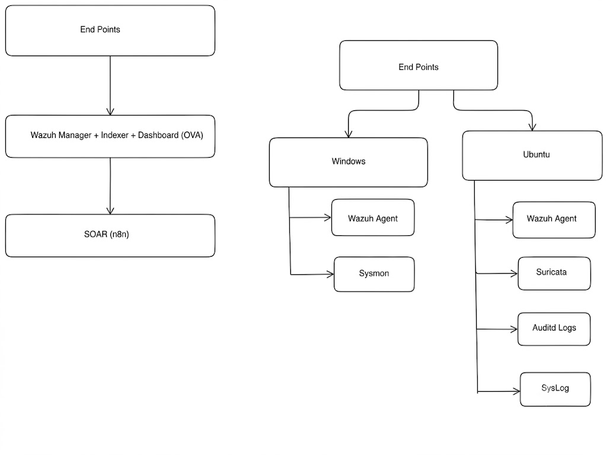
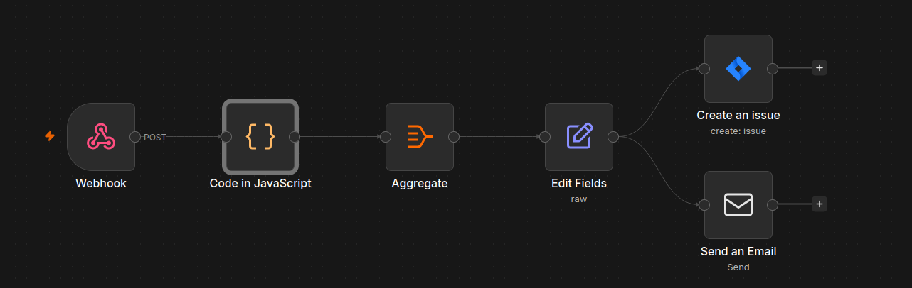

# Wazuh SIEM to n8n SOAR Integration

> A Security Operations Center (SOC) project that integrates Wazuh SIEM with n8n to automate security alert processing, incident creation, and analyst notifications.

---

## Overview

This project demonstrates a complete Security Operations Center (SOC) workflow using open-source security technologies. It combines endpoint monitoring, network intrusion detection, centralized log analysis, and workflow automation to process security alerts in real time.

The environment uses the **Wazuh OVA** as the central SIEM platform. Windows and Ubuntu systems generate security telemetry through the Wazuh Agent and additional monitoring tools. All events are collected by Wazuh, analyzed using detection rules, and converted into structured alerts.

A custom Python bridge continuously monitors newly generated alerts and forwards them to an n8n Webhook. The n8n workflow filters specific Rule IDs, formats alert information, creates Jira incidents, and sends email notifications to the security analyst.

As part of this project, a Data Loss Prevention (DLP) simulation was implemented using Wazuh File Integrity Monitoring (FIM). File creation, modification, deletion, or movement inside a monitored directory generates security alerts that automatically trigger the response workflow.

This project was developed to gain hands-on experience with SIEM operations, security monitoring, alert processing, and SOAR automation using open-source tools.

---
# System Architecture



The architecture consists of Windows and Ubuntu endpoints monitored by Wazuh Agents. Security telemetry from endpoint and network monitoring tools is forwarded to the Wazuh OVA, where events are analyzed and converted into alerts. A Python bridge streams these alerts to n8n for automated processing, resulting in email notifications and Jira incident creation.

---

# n8n Workflow



The workflow receives alerts from Wazuh through an HTTP Webhook. A JavaScript Code node filters only the Rule IDs associated with the DLP simulation. Matching alerts are aggregated, formatted, and used to create Jira issues while simultaneously notifying the security analyst through email.


---


# Features

- Centralized log collection using Wazuh OVA
- Windows endpoint monitoring with Microsoft Sysmon
- Ubuntu endpoint monitoring using Wazuh Agent
- Network intrusion detection using Suricata IDS
- Linux auditing with Auditd
- System log collection through Syslog
- File Integrity Monitoring (FIM)
- Real-time alert forwarding using Python
- HTTP Webhook integration with n8n
- Rule ID filtering using JavaScript
- Alert aggregation and formatting
- Automated Jira ticket creation
- Automated email notifications
- DLP simulation using File Integrity Monitoring
- Modular workflow design

---

# Lab Environment

| Component | Purpose |
|-----------|---------|
| Wazuh OVA | Centralized SIEM platform |
| Windows Virtual Machine | Endpoint monitoring using Wazuh Agent and Sysmon |
| Ubuntu Virtual Machine | Linux monitoring using Wazuh Agent |
| Microsoft Sysmon | Windows endpoint telemetry |
| Suricata IDS | Network intrusion detection |
| Auditd | Linux audit logging |
| Syslog | Linux system logging |
| Python | Alert forwarding service |
| n8n | Workflow automation |
| Jira Cloud | Incident management |
| SMTP | Email notifications |

---

# Technology Stack

| Category | Technology |
|----------|------------|
| SIEM | Wazuh OVA |
| SOAR | n8n |
| Endpoint Monitoring | Wazuh Agent |
| Windows Monitoring | Microsoft Sysmon |
| Network IDS | Suricata |
| Linux Auditing | Auditd |
| Log Collection | Syslog |
| Programming Language | Python |
| Workflow Logic | JavaScript |
| Ticketing Platform | Jira Cloud |
| Notification | SMTP Email |

---

# High-Level Workflow

```text
 Windows Endpoint
(Sysmon + Wazuh Agent)
          │
          │
          ▼
      Wazuh OVA
          ▲
          │
 Ubuntu Endpoint
(Wazuh Agent + Suricata +
 Auditd + Syslog)
          │
          ▼
     alerts.json
          │
          ▼
 Python Bridge Script
          │
      HTTP POST
          │
          ▼
     n8n Webhook
          │
          ▼
 JavaScript Filter
          │
          ▼
 Aggregate Data
          │
          ▼
 Edit Fields
      ┌───────────────┐
      │               │
      ▼               ▼
Create Jira      Send Email
      │               │
      └──────► Security Analyst
```

---

# Repository Structure

```text
wazuh-n8n-soar/
│
├── README.md                     # Project documentation
├── images/
│   ├── architecture.png          # System architecture diagram
│   ├── n8n-workflow.png          # n8n workflow
│   ├── wazuh-dashboard.png       # Wazuh dashboard
│   ├── jira-ticket.png           # Jira issue example
│   └── email-notification.png    # Email notification
│
├── scripts/
│   └── n8n-bridge.py             # Python alert forwarding service
│
├── n8n/
│   ├── filter-node.js            # Rule ID filtering logic
│   └── workflow.json             # Exported n8n workflow
│
└── configs/
    └── ossec-excerpt.xml         # Wazuh configuration reference
```

# Components

This project combines multiple open-source security tools to collect, analyze, and automate the response to security events. Each component has a specific role within the overall workflow.

---

# Wazuh OVA

The Wazuh OVA serves as the central Security Information and Event Management (SIEM) platform. It includes the Wazuh Manager, Indexer, and Dashboard in a preconfigured environment.

The Wazuh Manager receives telemetry from monitored endpoints, decodes incoming events, applies built-in and custom detection rules, and generates structured alerts. These alerts are written to `alerts.json`, which is continuously monitored by the Python bridge.

### Responsibilities

- Collect endpoint telemetry
- Decode incoming logs
- Apply detection rules
- Generate security alerts
- Store alerts in JSON format
- Display alerts through the Wazuh Dashboard

---

# Windows Endpoint

The Windows virtual machine is monitored using the Wazuh Agent together with Microsoft Sysmon.

Sysmon extends Windows logging by recording detailed endpoint activities, allowing Wazuh to detect suspicious behavior more effectively.

### Collected Telemetry

- Process creation
- Process termination
- Network connections
- Registry modifications
- Windows Event Logs
- File activity

---

# Ubuntu Endpoint

The Ubuntu virtual machine provides both host and network monitoring.

Several components work together to collect security telemetry before forwarding it to the Wazuh Manager.

Installed components include:

- Wazuh Agent
- Suricata IDS
- Auditd
- Syslog

### Collected Telemetry

- Authentication logs
- System logs
- Service logs
- Audit events
- Network intrusion alerts
- File activity

---

# Suricata Integration

Suricata is deployed on the Ubuntu system as the Network Intrusion Detection System (NIDS).

It continuously inspects network traffic and detects suspicious activity based on predefined signatures.

Detected events are written to the `eve.json` log file.

The Wazuh Agent monitors this log file and forwards the events to the Wazuh Manager, allowing network-based detections to appear alongside endpoint events within the SIEM dashboard.

---

# Python Bridge

A lightweight Python application connects Wazuh with n8n.

The bridge continuously monitors the `alerts.json` file generated by Wazuh. Whenever a new alert is written, it is parsed and forwarded to the configured n8n Webhook using an HTTP POST request.

Unlike the automation workflow, the bridge does not filter alerts. Every alert generated by Wazuh is forwarded, allowing n8n to decide which events require automation.

**Location**

```text
scripts/n8n-bridge.py
```

Responsibilities:

- Monitor `alerts.json`
- Read newly generated alerts
- Forward alerts to n8n
- Maintain continuous event streaming

---

# n8n Automation Workflow

The n8n workflow receives alerts from the Python bridge and processes them through several stages before notifying the security analyst.

The workflow is exported as:

```text
n8n/workflow.json
```

---

## Webhook

The workflow begins with an HTTP Webhook.

This node receives every alert forwarded from the Python bridge in JSON format.

---

## JavaScript Code Node

The JavaScript Code node performs the filtering logic for the workflow.

It extracts the Wazuh Rule ID from each incoming alert and compares it against a predefined list of Rule IDs.

Only alerts matching the configured Rule IDs continue through the workflow.

All other alerts are discarded.

**Location**

```text
n8n/filter-node.js
```

Responsibilities:

- Extract Rule ID
- Validate incoming alerts
- Filter unrelated events
- Pass matching alerts to downstream nodes

---

## Aggregate Node

The Aggregate node combines important alert fields into a structured object.

This reduces repeated processing and prepares the data for reporting and incident creation.

---

## Edit Fields Node

The Edit Fields node formats the final incident information.

The workflow prepares information including:

- Rule ID
- Alert Level
- Alert Description
- Hostname
- Timestamp
- File Path

This formatted output is shared with both the Jira and Email nodes.

---

## Jira Integration

The workflow connects to Jira Cloud using an API token.

Whenever one of the configured Rule IDs is detected, n8n automatically creates a Jira issue containing the alert details.

Each incident includes information such as:

- Alert Summary
- Rule ID
- Alert Description
- Hostname
- Timestamp
- File Path

This eliminates the need for manually creating incident tickets.

---

## Email Notification

After formatting the alert, n8n sends an email notification to the security analyst.

The email provides the essential alert details so that the analyst can begin investigating the incident immediately.

---

# DLP Simulation

To demonstrate an automated incident response workflow, this project includes a simple Data Loss Prevention (DLP) simulation.

A directory on the monitored endpoint is configured using Wazuh File Integrity Monitoring (FIM).

Whenever a file inside the protected directory is:

- Created
- Modified
- Renamed
- Moved
- Deleted

Wazuh generates a security alert.

The Python bridge forwards the alert to n8n.

The JavaScript Code node checks the Rule ID.

Only the configured DLP Rule IDs continue through the workflow.

Matching alerts are then:

1. Received through the Webhook.
2. Filtered using the JavaScript Code node.
3. Aggregated into a structured format.
4. Formatted using the Edit Fields node.
5. Used to create a Jira incident.
6. Sent as an email notification to the security analyst.

This workflow demonstrates how SIEM alerts can be transformed into automated incident response using Wazuh and n8n.

---

# Screenshots

## Wazuh Dashboard

```text
images/wazuh-dashboard.png
```

---

## n8n Workflow

```text
images/n8n-workflow.png
```

---

## Jira Incident

```text
images/jira-ticket.png
```

---

## Email Notification

```text
images/email-notification.png
```

# Requirements

Before setting up the project, ensure the following software and services are available.

## Operating Systems

- Ubuntu Linux
- Windows 10/11

## Software

- Wazuh OVA
- Wazuh Agent
- Microsoft Sysmon
- Suricata IDS
- Auditd
- Syslog
- Python 3
- n8n
- Jira Cloud Account

---

# Installation

## 1. Deploy Wazuh OVA

Download the official Wazuh OVA and import it into your virtualization platform.

Complete the initial setup and verify access to the Wazuh Dashboard.

---

## 2. Configure Windows Endpoint

Install:

- Wazuh Agent
- Microsoft Sysmon

Register the Windows agent with the Wazuh Manager and verify that logs are being received.

---

## 3. Configure Ubuntu Endpoint

Install:

- Wazuh Agent
- Suricata IDS
- Auditd

Configure the Wazuh Agent to monitor:

- Suricata `eve.json`
- Audit logs
- Syslog
- File Integrity Monitoring (FIM)

Restart the Wazuh Agent after completing the configuration.

---

## 4. Configure Python Bridge

Clone this repository.

```bash
git clone https://github.com/Sinan7204/soc-automation-project.git


Navigate to the project directory.

```bash
cd wazuh-n8n-soar
```

Install the required dependency.

```bash
pip install requests
```

Update the Webhook URL inside:

```text
scripts/n8n-bridge.py
```

Run the bridge.

```bash
python3 scripts/n8n-bridge.py
```

---

## 5. Configure n8n

Import the workflow from:

```text
n8n/workflow.json
```

Verify the following nodes are configured correctly:

- Webhook
- JavaScript Code
- Aggregate
- Edit Fields
- Jira
- Send Email

Activate the workflow.

---

## 6. Configure Jira

Create a Jira Cloud API Token.

Configure the Jira node inside n8n with:

- Jira URL
- Email Address
- API Token
- Project Key

Verify that the node can create issues successfully.

---

## 7. Configure Email

Configure the Email node using your SMTP server.

Provide:

- SMTP Host
- SMTP Port
- Username
- Password
- Sender Address
- Recipient Address

Test the node to confirm email delivery.

---

# Running the Project

Start the components in the following order.

1. Start the Wazuh OVA.
2. Start Windows and Ubuntu virtual machines.
3. Verify both Wazuh Agents are connected.
4. Start the Python Bridge.
5. Start n8n.
6. Activate the workflow.
7. Generate security events.

---

# Testing

The project can be tested by generating events on the monitored endpoints.

Examples include:

### Windows

- Process execution
- Registry modification
- File creation
- File deletion

### Ubuntu

- SSH authentication failures
- File modifications
- Audit events
- Suricata alerts

### DLP Simulation

Perform one of the following operations inside the monitored directory:

- Create a file
- Modify a file
- Rename a file
- Move a file
- Delete a file

Verify the following sequence:

1. Wazuh generates an alert.
2. The alert appears in the Wazuh Dashboard.
3. The alert is written to `alerts.json`.
4. The Python bridge forwards the alert.
5. n8n receives the alert.
6. The JavaScript Code node checks the Rule ID.
7. Matching alerts continue through the workflow.
8. A Jira issue is created.
9. An email notification is delivered.

---

# Repository Files

```text
README.md
│
├── images/
│   ├── architecture.png
│   ├── n8n-workflow.png
│   ├── wazuh-dashboard.png
│   ├── jira-ticket.png
│   └── email-notification.png
│
├── scripts/
│   └── n8n-bridge.py
│
├── n8n/
│   ├── workflow.json
│   └── filter-node.js
│
└── configs/
    └── ossec-excerpt.xml
```

---

# Future Improvements

Possible enhancements for this project include:

- Slack notifications
- Microsoft Teams integration
- VirusTotal integration
- AbuseIPDB enrichment
- Threat Intelligence feeds
- Automated Active Response
- Severity-based workflows
- Multiple incident playbooks
- Dashboard for forwarded alerts
- Docker deployment

---

# Learning Outcomes

This project helped me gain practical experience with several SOC technologies and workflows, including:

- Deploying and managing the Wazuh OVA
- Configuring Wazuh Agents on Windows and Ubuntu
- Integrating Microsoft Sysmon with Wazuh
- Integrating Suricata IDS with Wazuh
- Collecting Linux audit and system logs
- Building a Python-based alert forwarding service
- Creating workflow automation using n8n
- Filtering security events using JavaScript
- Working with REST APIs
- Automating Jira incident creation
- Automating email notifications
- Implementing File Integrity Monitoring (FIM)
- Building an end-to-end SIEM to SOAR pipeline

---

# Acknowledgements

This project was developed as a hands-on learning project to explore SIEM, SOAR, endpoint monitoring, network intrusion detection, and security automation using open-source technologies.

The implementation combines multiple security tools into a single automated workflow to demonstrate how security alerts can be transformed into actionable incidents with minimal manual effort.

---

# License

This project is released under the Private and Own License.